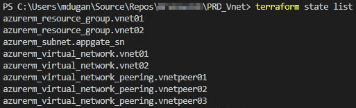
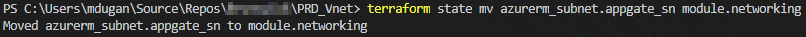
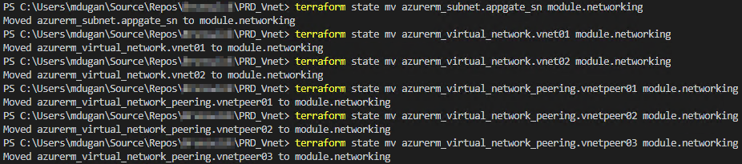
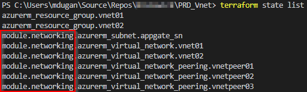
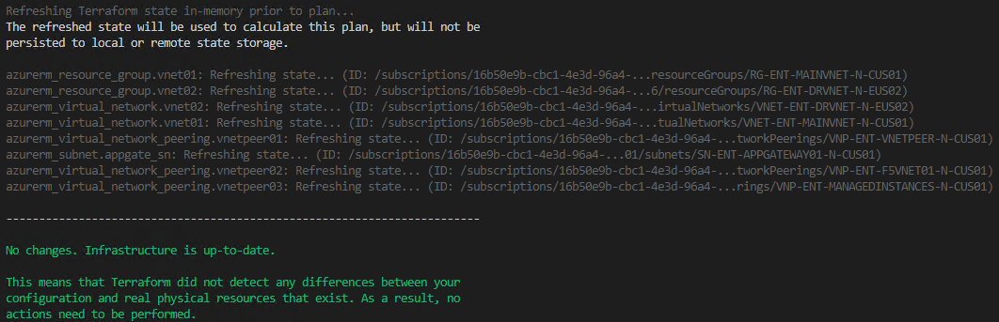
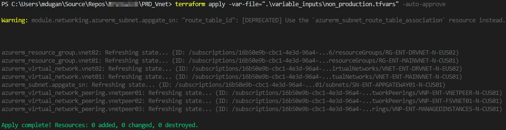

- [Terraform 102](#terraform-102)
  - [1.2.1 Terraform State](#121-terraform-state)
    - [1.2.1.1 Remote State Files](#1211-remote-state-files)
    - [1.2.1.2 Remote State Management](#1212-remote-state-management)
  - [1.2.2 Provider Blocks](#122-provider-blocks)
  - [1.2.3 Modules](#123-modules)
- [Labs](#labs)
  - [Exercise 1: Using a Remote State File](#exercise-1-using-a-remote-state-file)
  - [Exercise 2: Automating Your Environment with a Service Principle](#exercise-2-automating-your-environment-with-a-service-principle)
  - [Exercise 3: Leveraging Modules to Save on Duplicate Code](#exercise-3-leveraging-modules-to-save-on-duplicate-code)

# Terraform 102

## 1.2.1 Terraform State

Known resource states are stored as JSON data in a [state file](https://www.terraform.io/docs/state/) which Terraform references when running a plan or apply step to decide whether any resources will be created, changed, or destroyed. When running Terraform locally, a state file is automatically created when a plan or apply command is given to Terraform.

At plan/apply time, Terraform compares the current state of resources with their expected state in the state file. If a resource deviates from expected state, it will be recreated during an apply step. Also, if a configuration step fails during apply then the resource will be marked as tainted for further remediation. [Workspaces](https://www.terraform.io/docs/state/workspaces.html) are used to separate code level environment state files from one another while still using a common set of Terraform configuration files.


### 1.2.1.1 Remote State Files

It is best practice to use a [remote state file](https://www.terraform.io/docs/state/remote.html) when working in a team. If team members each had their own copy of the state file, resource consistency would be lost since everyone would be working outside of a "single source of truth". In this scenario, state files are stored remotely in a storage account per the remote backend configuration given to Terraform. Remote state configuration is defined with a [backend](https://www.terraform.io/docs/backends) in a ```terraform``` block like the following example which would store state in an AWS S3 bucket in the US East 2 region.

It is important to note that **backend blocks do not support interpolation**. Any interpolations used in a backed block will be interpreted as literal strings.

```
terraform {
  backend "s3" {
    bucket = "my-fresh-bucket"
    key    = "secret/path/to/my/secret/key"
    region = "us-east-2"
  }
}
```

### 1.2.1.2 Remote State Management

Terraform defines the [state](https://www.terraform.io/docs/commands/state/index.html) command as a concept that is used for advanced state management. Typically, something about your environment configuration must be out of lineage if you’re planning on using these CLI commands. This isn’t something that is ideal or normally performed as a regular routine, and it isn’t recommended to directly edit the state file as that will only cause more issues with lineage.

Instead, Terraform does the heavy lifting for you that will assess whether a push, move, or any other request can be done and will carefully do so. In fact, it intentionally creates a backup state file so a simple mistake could be reversible by re-uploading the previous state file. It is important to note that this situation applies to both local state files as well as a remote state file in a backend configuration.

Here’s the usage syntax, if you aren’t familiar already:

`terraform state \<subcommand\> [options] [args]`

Let’s start out by showing what we currently have in the state file via the CLI. Run the following command:

`terraform state list`

*Output*:



Notice that the resources do not have a module specified at the beginning of their configuration name. Now, let’s see if we can move from our current state to our future state, which is essentially moving all networking components into a new module named “networking”. Run the following command:

`terraform state mv azurerm_subnet.appgate_sn module.networking`

*Output*:



Now, let’s repeat this process for the other virtual networks along with the peerings and check against our updated configuration in the main.tf file. Here’s the output:



Here’s what the *updated* state list looks like now:



Now, let’s see what we get when we run a plan. Terraform should expect 0 changes needed and should be happy. Run a plan command and target a specific variable file if you aren’t loading variables automatically (e.g.: `terraform plan -var-file=".\variable_inputs\non_production.tfvars"`). Here’s the output:



Perfect! Let’s make sure this is the case by applying the updated local configuration and ensure that state is updated (e.g.: `terraform apply -var-file=”.\variable_inputs\non_production.tfvars”`). Here’s the output:



There you have it – a state file that has been updated with resources in a new module.

## 1.2.2 Provider Blocks

Terraform connects to a myriad of infrastructure solutions using intermediate API translators called [providers](https://www.terraform.io/docs/providers/). For instance, the [azurerm](https://www.terraform.io/docs/providers/azurerm/index.html) provider can be used to spin up resources in Microsoft Azure.

A **provider** block contains all the information needed to initialize a connection with the infrastructure solution in question. For instance, an azurerm **provider** block contains the service principal credentials for accessing a given Azure subscription. In addition to credentials, a version specification can be added to prevent unwanted provider version upgrades at build time.

The azurerm provider requires contributor access to an Azure subscription in order to make changes in that environment. Credentials for said service principal can be created from the [Azure CLI or the Azure portal](https://www.terraform.io/docs/providers/azurerm/authenticating_via_service_principal.html). Once created, the credentials can be entered in a local shell through az login or as defined values for automated deployments within Terraform configuration files.

```
provider "azurerm" {
    version         = "~> 1.22"
    subscription_id = "${var.azure_sub_id}"
    client_id       = "${var.azure_client_id}"
    client_secret   = "${var.azure_client_secret}"
    tenant_id       = "${var.azure_tenant_id}"
}
```

## 1.2.3 Modules


Terraform [modules](https://www.terraform.io/docs/modules/index.html) simply
consist of Terraform code that is used as a repeatable group. Any valid
Terraform deployment code can be used as a module. What makes a given set of
Terraform code a module is that it gets called by the root module by using a
[module block](https://www.terraform.io/docs/modules/usage.html). The only
required input for module blocks is the
[source](https://www.terraform.io/docs/modules/sources.html) of the module.
Modules can be sourced from a variety of locations including local files and
GitHub. For example, a local module could be called by the following module
block where the source input is set to a local directory called
“terraform_naming_module”.

```
module "sccm_sn" {
    source                        = "./terraform_naming_module"
        resource_type_input       = "subnet"
        business_unit_input       = "${var.business_unit}"
        workload                  = "SCCM"
        environment_input         = "${var.environment}"
        location_descriptor_input = "${var.location}"
        naming_index              = "01"
}
```

This block calls a module and passes variables into the module to
use during processing. In addition, modules can use output blocks to pass
resource information and calculated values back to the parent module after
processing. Between module inputs and outputs, their value in repeatability
becomes clear. A single module can be used many times to create similar
resources with slightly different names, sizes, shapes, etc. without reinventing
the wheel every time. Not only does this save time and effort, but can help
maintain consistency between infrastructure admins within an organization since
they can all use the same set of standardized modules in their work.

# Labs

## Exercise 1: Using a Remote State File

Create a backend configuration file for the deployment you created at the end of terraform_101. This backend can use any service, such as [AWS S3](https://www.terraform.io/docs/backends/types/s3.html), [Azure storage accounts](https://www.terraform.io/docs/backends/types/azurerm.html), or [GCS](https://www.terraform.io/docs/backends/types/gcs.html)

Make sure to use ```terraform -destroy``` on any resources leftover from your previous testing. Since we are creating a net new state file, any existing resources will cause errors when trying to deploy because Terraform won't know that they already exist.

## Exercise 2: Automating Your Environment with a Service Principle

**NOTE: Always apply any credential data directly through the command line or use a secret management solution whenever possible! Be careful to never commit any credential data to a public repository (or even a private one). [Nefarious individuals](https://digitalguardian.com/blog/deloitte-hack-underscores-risk-credential-leaks) are [always](https://docs.aws.amazon.com/general/latest/gr/aws-access-keys-best-practices.html) crawling [repos](https://www.theregister.co.uk/2015/01/06/dev_blunder_shows_github_crawling_with_keyslurping_bots/) for this data and they [will use it](http://vertis.io/2013/12/16/unauthorised-litecoin-mining.html)!**

Add a ```provider``` block to one of your *.tf files that utilizes a service principle. This requires that you create a service principle account to your cloud provider tenant. Instructions for creating the account and using its credentials can be found on the [backend type page](https://www.terraform.io/docs/backends/types/index.html) published by Hashicorp. Adding the service principle should show no needed changes to your resources once it authenticates successfully.

## Exercise 3: Leveraging Modules to Save on Duplicate Code

Turn your existing Terraform deployment into a module and call it using a parent *.tf file. This should result in creating the exact same resources from the previous two exercises.

Make sure to use ```terraform -destroy``` on any resources leftover from your previous testing. Moving to a module will change the state identifier for your resources which will cause errors when trying to deploy because Terraform won't know that they already exist.