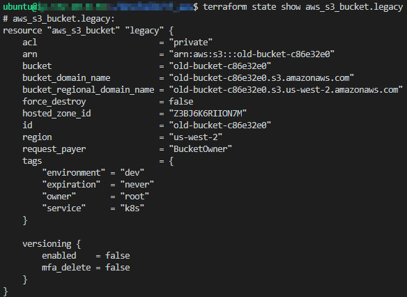
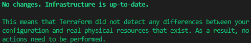

- [Terraform 103](#terraform-103)
  - [1.3.1 Outputs](#131-outputs)
  - [1.3.2 Import Resources](#132-import-resources)
  - [1.3.3 Functions](#133-functions)
- [Labs](#labs)
  - [Exercise 1: Leverage Functions](#exercise-1-leverage-functions)
  - [Exercise 2: Import Existing Resources](#exercise-2-import-existing-resources)
  - [Exercise 3: Generate Deployment Outputs](#exercise-3-generate-deployment-outputs)

# Terraform 103

## 1.3.1 Outputs

[Outputs](https://www.terraform.io/docs/configuration/outputs.html) return specified values after running ```terraform apply```  to be used in other modules, CI workflows, sanity checks, and more. Values returned by ```output``` blocks can take any arbitrary form, often defined as important resource attributes or calculated deployment aggregates. Each unique ```output``` is defined using a block structure similar to ```variable``` definitions where only an ID is defined after the block type declaration and the ```value``` parameter is used to specify an actual output value.

```
output "bastion_public_dns" {
    value       = aws_instance.bastion.public_dns
    description = "Public DNS name of bastion instance"
}
```

These blocks can optionally include the additional parameters ```description```, ```sensitive```, and ```depends_on``` to further customize their behavior. Consuming values from a defined ```output``` in a given child module takes the form of ```module.module_id.output_id```. It is important to define outputs in child modules since resource attributes contained within them are not exposed to parent modules by default.

## 1.3.2 Import Resources

Terraform [```import```](https://www.terraform.io/docs/import/index.html) is a utility that programmatically imports resources not currently managed by a Terraform deployment into a Terraform state file. This is commonly used for slowly transitioning a given set of existing infrastructure for a previously developed service into Terraform management to take advantage of Terraform's state management capabilities. As of version 0.13, the ```import``` command only pulls resources into the state tree and does not write ```resource``` blocks to support the imported resource. Therefore, a "skeleton" ```resource``` block that defines the resrouce type and ID of the target resource is the bare minimum required information for ```import``` to function. A simple workflow for importing a given infrastructure component consists of:

  1. Write a ```resource``` block skeleton that defined the resource type and ID for ```import``` to leverage during state file modification
```
resource "aws_s3_bucket" "legacy" {
}
```
  2. Run the ```import``` command against a given remote resource URI that targets the newly written ```resource``` skeleton type and ID
```
terraform import aws_s3_bucket.legacy old-bucket-c86e32e0
```
  3. Run the ```state show``` command against the newly imported resource to view the parameters of the remote infrastructure



  4. Update the skeleton ```resource``` block to match required and non-default parameters of the remote infrastructure
```
resource "aws_s3_bucket" "legacy" {
    bucket = "old-bucket-c86e32e0"
    acl    = "private"

    tags   = {
        environment = "dev"
        expiration  = "never"
        owner       = "root"
        service     = "k8s"
    }
}
```
  5. Run a ```plan``` to confirm that all parameters match and, if required, update the ```resource``` block as needed to ensure no changes will be made to the remote resource



## 1.3.3 Functions

[Functions](https://www.terraform.io/docs/configuration/functions.html) in HCL provide capabilities to transform values and automate common infrastructure designs such as CIDR block segmentation. Leveraging these capabilities not only saves time and effort when developing infrastructure templates, but also improves readability of complex deployments by dramatically reducing the number of lines needed to express in-depth logic. Functions follow a familiar pattern of ```functionName(parameter1, parameter2)``` similar to many other programming languages. 

Consider a scenario where multiple subnets are used to ensure resources are appropriately provisioned across availability zones to ensure high availability. Without the use of functions, the resulting code is lengthy, difficult to read, and requires multiple hardcoded values. To preface this example we first define the variables and base VPC to use in our deployment.
```
variable "region" {
    type = string
    default = "us-west-2"
    description = "Region for deployment"
}

variable "vpc_cidr" {
    type = string
    default = "172.20.0.0/16"
    description = "Parent domain name"
}

locals {
  az = [
    "${var.region}a",
    "${var.region}b",
    "${var.region}c"
  ]
}

resource "aws_vpc" "core" {
  cidr_block           = var.vpc_cidr
}
```
Without using functions, the template for highly available subnets is defined in a verbose manner like below.
```
###Private Subnets###
resource "aws_subnet" "private_a" {
  availability_zone = local.az[0]
  vpc_id            = aws_vpc.core.id
  cidr_block        = "172.20.0.0/22"
}

resource "aws_subnet" "private_b" {
  availability_zone = local.az[0]
  vpc_id            = aws_vpc.core.id
  cidr_block        = "172.20.4.0/22"
}

resource "aws_subnet" "private_c" {
  availability_zone = local.az[0]
  vpc_id            = aws_vpc.core.id
  cidr_block        = "172.20.8.0/22"
}

###Public Subnets###
resource "aws_subnet" "public_a" {
  availability_zone = local.az[0]
  vpc_id            = aws_vpc.core.id
  cidr_block        = "172.20.32.0/19"
}

resource "aws_subnet" "public_b" {
  availability_zone = local.az[1]
  vpc_id            = aws_vpc.core.id
  cidr_block        = "172.20.64.0/19"
}

resource "aws_subnet" "public_c" {
  availability_zone = local.az[2]
  vpc_id            = aws_vpc.core.id
  cidr_block        = "172.20.96.0/19"
}
```
However by using the [```count```](https://www.terraform.io/docs/configuration/resources.html#count-multiple-resource-instances-by-count) meta-argument along with [```length()```](https://www.terraform.io/docs/configuration/functions/length.html) and [```cidrsubnet()```](https://www.terraform.io/docs/configuration/functions/cidrsubnet.html) functions the code is significantly more compact, modular, and human-readable.
```
###Private Subnets###
resource "aws_subnet" "private" {
  count             = length(local.az)
  availability_zone = local.az[count.index % 3]
  vpc_id            = aws_vpc.core.id
  cidr_block        = cidrsubnet(aws_vpc.core.cidr_block, 6, count.index)
}

###Public Subnets###
resource "aws_subnet" "public" {
  count             = length(local.az)
  availability_zone = local.az[count.index % 3]
  vpc_id            = aws_vpc.core.id
  cidr_block        = cidrsubnet(aws_vpc.core.cidr_block, 3, count.index + 1)
}
```
# Labs

## Exercise 1: Leverage Functions

Using the AWS VPC definitions from [1.3.3](#133-functions) as a guide, add code to your deployment from [Exercise 2: Automating Your Environment with a Service Principle](#exercise-2-automating-your-environment-with-a-service-principle) to create a similar VPC design with multiple subnets that each reside in unique availability zones. Try modifying the parameters of the ```cidrsubnet()``` function and observe their effects.

## Exercise 2: Import Existing Resources

Manually deploy an additional subnet into the VPC deployed in [Exercise 1: Leverage Functions](#exercise-1-leverage-functions) via the GUI console. Once the subnet is provisioned, follow the import process described in [1.3.2 Import Resources](#132-import-resources) to bring the new subnet under Terraform control.

## Exercise 3: Generate Deployment Outputs

Define ```output``` blocks that return the CIDR ranges used by the public and private subnets deployed in the previous exercises.